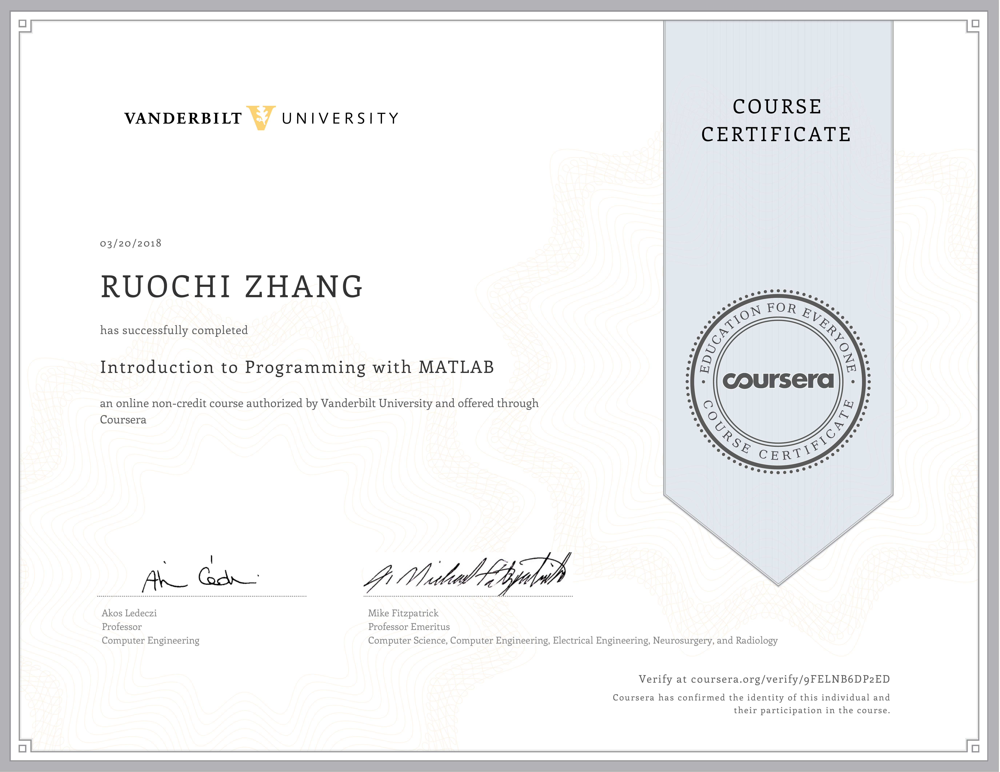
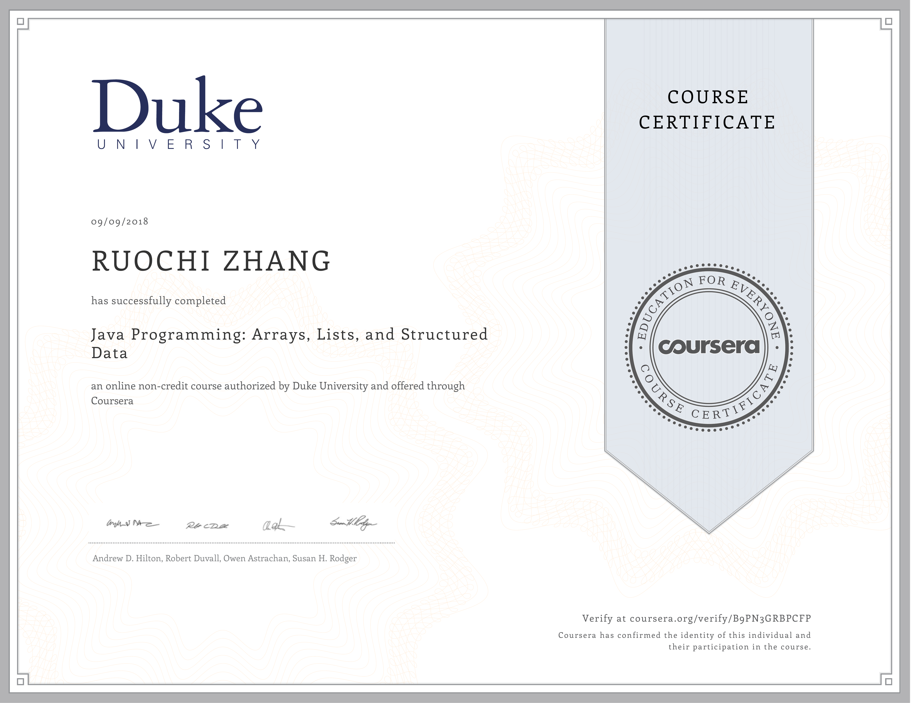
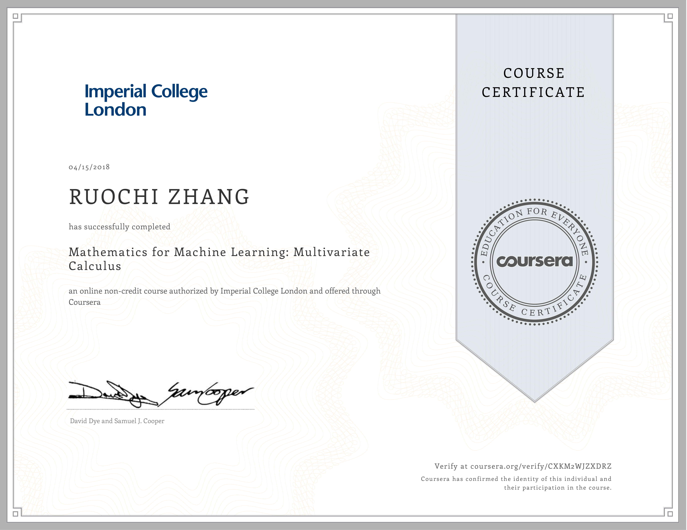
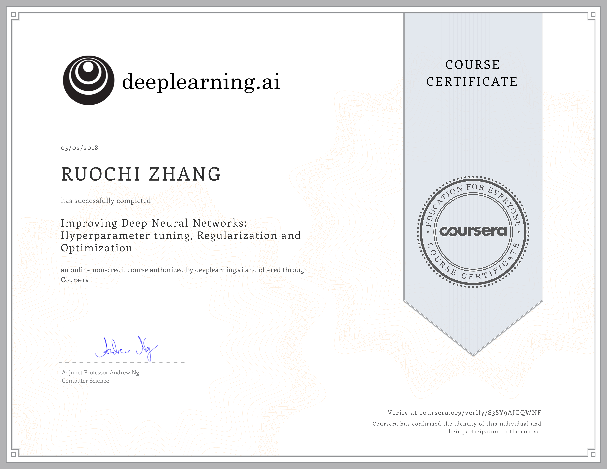
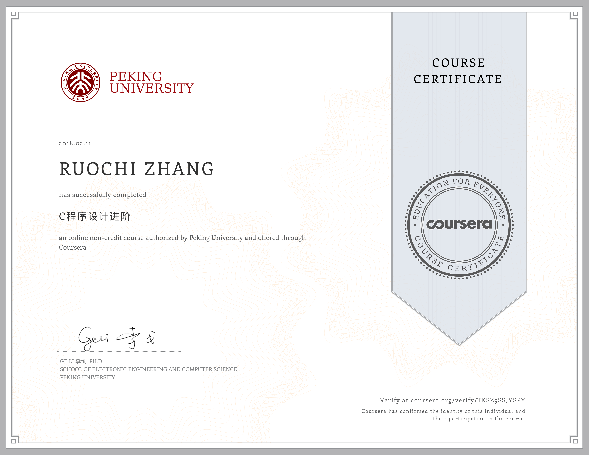
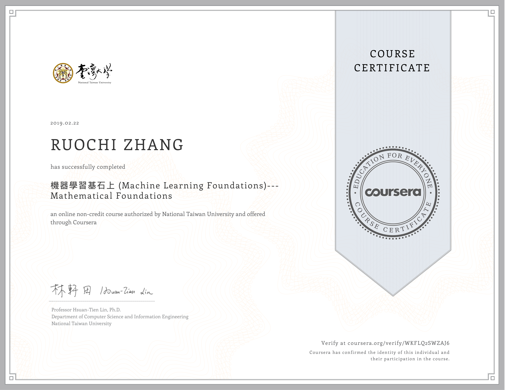
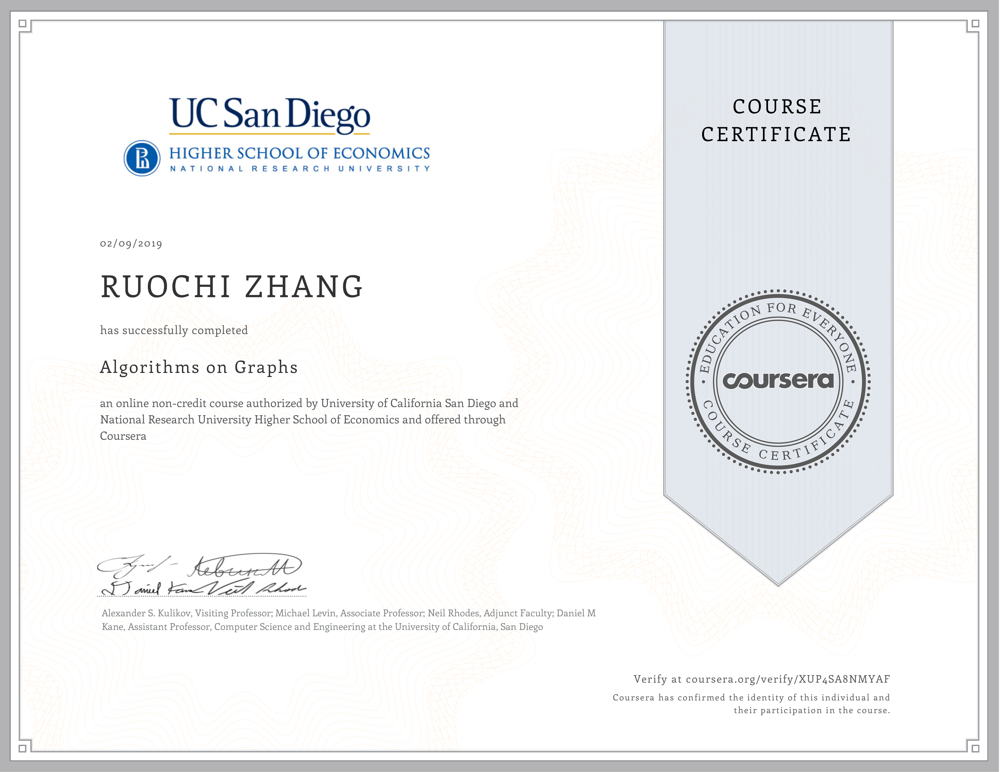
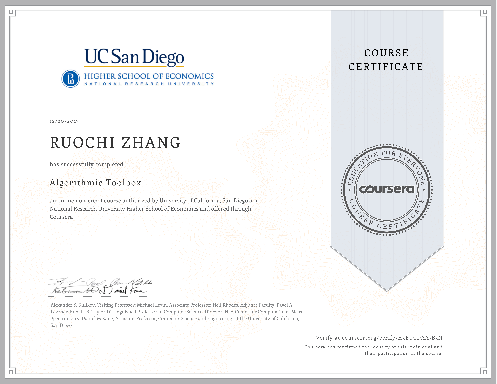

## I love MOOCs and MOOCs love me

### Certificates

These are some courses I have finished

### Here are some courses which are good for becoming a good computer scientist and data scientist

### MATH
|Course|Institute|Rating|Type|Status|Commnet|
|:---|:---|:---|:---|:---|:---|
|[Improving your statistical inferences](https://www.coursera.org/learn/statistical-inferences/home/welcome)|Eindhoven University of Technology|4.9|Statistical|||
|[Matrix Algebra for Engineers](https://www.coursera.org/learn/matrix-algebra-engineers/home/welcome)|The Hong Kong University of Science and Technology||Linear Algebra|||
|[Mathematical Thinking in Computer Science](https://www.coursera.org/learn/what-is-a-proof/home/welcome)|UCSanDiego||Discrete Mathematics|||
|[Mathematics for Machine Learning Specialization](https://www.coursera.org/specializations/mathematics-machine-learning)|Imperail London University|4.5| Math|||
|[ARCHIVED Convex Optimization]( https://lagunita.stanford.edu/courses/Engineering/CVX101/Winter2014/info)|Standford||Optimization|||
|[Statistical Learning](https://lagunita.stanford.edu/courses/HumanitiesSciences/StatLearning/Winter2016/course/)|Standford||Probability and Statistics|||
|[Probability and Statistics](https://lagunita.stanford.edu/courses/course-v1:OLI+ProbStat+Open_Jan2017/course/)|Standford||Probability and Statistics|||
|[Mathematics for Computer Science](https://ocw.mit.edu/courses/electrical-engineering-and-computer-science/6-042j-mathematics-for-computer-science-spring-2015/index.htm)|MIT||Math|||
|[Basic Modeling for Discrete Optimization](https://www.coursera.org/learn/lisan-youhua-jianmo-jichupian/home/welcome)|The Chinese University of Hong Kong||Optimization|||
|[Advanced Modeling for Discrete Optimization](https://www.coursera.org/learn/lisan-youhua-jianmo-gaojiepian)|The Chinese University of Hong Kong ||Optimization|||
|[Discrete Mathematics Generality](https://www.coursera.org/learn/dmathgen)|Pking University|4.7|Discrete Mathematics|||
|[Methods and Statistics in Social Sciences](https://www.coursera.org/specializations/social-science)|University of Amsterdam||Statistics|||
|[Introduction to Discrete Mathematics for Computer Science](https://www.coursera.org/specializations/discrete-mathematics)|UCSanDiego|4.5|Discrete Mathematics|||
|[Bayesian Statistics: From Concept to Data Analysis](https://www.coursera.org/learn/bayesian-statistics/home/welcome)|UCSantaCruz||Statistics|||
|[Introduction to Mathematical Thinking](https://www.coursera.org/learn/mathematical-thinking/home/welcome)|Standford||Math|||
|[18.06 Linear Algebra](https://mitmath.github.io/1806/)|MIT||Linear Algebra|||
|[Calculus Applied!](https://courses.edx.org/courses/course-v1:HarvardX+CalcAPL1x+2T2018/course/)|Harvard||Calculus|||
|[Probability and Statistics in Data Science using Python](https://courses.edx.org/courses/course-v1:UCSanDiegoX+DSE210x+3T2018/course/)|UCSanDiego||Probability and Statistics|||
|[Introduction to Probability](https://courses.edx.org/courses/course-v1:HarvardX+STAT110x+2T2017/course/)|Harvard||Probability and Statistics|||
|[Calculus 1A: Differentiation](https://www.edx.org/course/calculus-1a-differentiation)|MIT||Calculus|||
|[Calculus 1B: Integration](https://www.edx.org/course/calculus-1b-integration)|MIT||Calculus|||
|[Calculus 1C: Coordinate Systems & Infinite Series](https://www.edx.org/course/calculus-1c-coordinate-systems-infinite-mitx-18-01-3x-0)|MIT||Calculus|||
|[Linear Algebra - Foundations to Frontiers](https://www.edx.org/course/linear-algebra-foundations-to-frontiers)|UT Austin||Linear Algebra||||

### Computer Scicence
|Course|Institute|Rating|Type|Status|Commnet|
|:---|:---|:---|:---|:---|:---|
|[Cloud Computing Specialization](https://www.coursera.org/specializations/cloud-computing?)|UIUC|4.4|Cloud Computing|||
|[Data Structures and Algorithms](https://www.coursera.org/specializations/data-structures-algorithms)|UCSanDiego|4.6|Algorithm and Data Structure|||
|[Algorithm Part1](https://www.coursera.org/learn/algorithms-part1)|Priceton|4.9|Algorithm and Data Structure|||
|[Algorithm Part2](https://www.coursera.org/learn/algorithms-part2)|Priceton|4.9|Algorithm and Data Structure|||
|[Nand to Tetris Part I](https://www.coursera.org/learn/nand2tetris1)|Hebrew University of Jerusalem|5|System|||
|[Nand to Tetris Part II](https://www.coursera.org/learn/nand2tetris2)|Hebrew University of Jerusalem|5|System|||
|[Algorithms Specialization](https://www.coursera.org/specializations/algorithms)|Standford||Algorithm and Data Structure|||
|[An Introduction to Programming the Internet of Things (IOT) Specialization](https://www.coursera.org/specializations/iot)|University of California, Irvine|4.6|Hardware|||
|[Functional Programming in Scala](https://www.coursera.org/specializations/scala)|École Polytechnique Fédérale de Lausanne|4.5|Programming Language|||
|[Analysis of Algorithms](https://www.coursera.org/learn/analysis-of-algorithms/home/welcome)|Priceton||Algorithm and Data Structure|||
|[Parallel, Concurrent, and Distributed Programming in Java](https://www.coursera.org/specializations/pcdp)|Rice University|4.5|Programming Language|||
|[Probabilistic Graphical Models Specialization](https://www.coursera.org/specializations/probabilistic-graphical-models)|Standford|4.7|Graphical Model|||
|[Bitcoin and Cryptocurrency Technologies](https://www.coursera.org/learn/cryptocurrency/home/welcome)|Priceton||Bitcoin|||
|[Computer Science: Algorithms, Theory, and Machines](https://www.coursera.org/learn/cs-algorithms-theory-machines/home/welcome)|Princeton University||System|||
|[CS 61A: Structure and Interpretation of Computer Programs](http://inst.eecs.berkeley.edu/~cs61a/fa18/)|UCBerkeley||System|||
|[CS161: Algorithm](http://web.stanford.edu/class/archive/cs/cs161/cs161.1194/schedule.html)|Standford||Algorithm and Data Structure|||
|[CS224n: Natural Language Processing with Deep Learning](http://web.stanford.edu/class/cs224n/)|Stanford||Natural Language Processing|||
|[Operating Systems Design and Implementation](http://web.stanford.edu/class/cs140e/)|Standford||Operating Systems|||
|[Operating System Engineering](https://pdos.csail.mit.edu/6.828/2017/schedule.html)|MIT||Operating Systems|||
|[6.006 Introduction to Algorithms](https://learning-modules.mit.edu/class/index.html?uuid=/course/6/sp19/6.006#dashboard)|MIT||Algorithm and Data Structure||||

### Machine Learning
|Course|Institute|Rating|Type|Status|Commnet|
|:---|:---|:---|:---|:---|:---|
|[Machine Learning Foundations](https://www.coursera.org/specializations/machine-learning)|University of Washington||Machine Learning|||
|[Advanced Machine Learning Specialization](https://www.coursera.org/specializations/aml)|National Research University Higher School of Economics||Deep Learning|||
|[Advanced Machine Learning with TensorFlow on Google Cloud Platform Specialization](https://www.coursera.org/specializations/advanced-machine-learning-tensorflow-gcp)|Google|4.6|Machine Learning|||
|[Machine Learning](https://www.coursera.org/learn/machine-learning)|Standford|4.9|Machine Learning|||
|[Deep Learning](https://www.coursera.org/specializations/deep-learning)|deeplearning.ai|4.9|Deep Learning|||
|[Self-Driving Cars Specialization](https://www.coursera.org/specializations/self-driving-cars)|University of Toronto|5|Self-Driving|||
|[Self-Driving Cars Teach-Out](https://www.coursera.org/learn/self-driving-cars-teach-out/home/welcome)|University of Michigan|4.9|Self-Driving|||
|[機器學習基石上](https://www.coursera.org/learn/ntumlone-mathematicalfoundations/home/welcome)|National Taiwan University|4.9|Machine Learning|||
|[機器學習基石下](https://www.coursera.org/learn/ntumlone-algorithmicfoundations)|National Taiwan University|4.9|Machine Learning|||
|[Recommender Systems Specialization](https://www.coursera.org/specializations/recommender-systems)|University of Minnesota||Recommender Systems|||
|[CS224n: Natural Language Processing with Deep Learning](http://web.stanford.edu/class/cs224n/)|Stanford||Natural Language Processing|||
|[CS231n: Convolutional Neural Networks for Visual Recognition](http://cs231n.stanford.edu)|Standford||Computer Vision||||

### Artificial Intelligence
|Course|Institute|Rating|Type|Status|Commnet|
|:---|:---|:---|:---|:---|:---|
|[AI for Everyone](https://www.coursera.org/learn/ai-for-everyone)|deeplearning.ai|5|Artificial Intelligence|completed|good course for AI from business perspective|
|[Artificial Intelligence](https://courses.edx.org/courses/BerkeleyX/CS188.1x-4/1T2015/course/)|UCBerkeley||Artificial Intelligence|||
|[Data Mining Specialization](https://www.coursera.org/specializations/data-mining)|UIUC||Data Mining|||
|[Data Systems Specialization](https://www.coursera.org/specializations/data-systems)|ASU|4.0|Database||||

